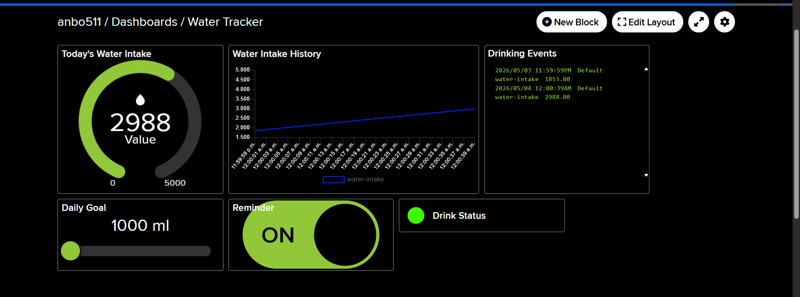
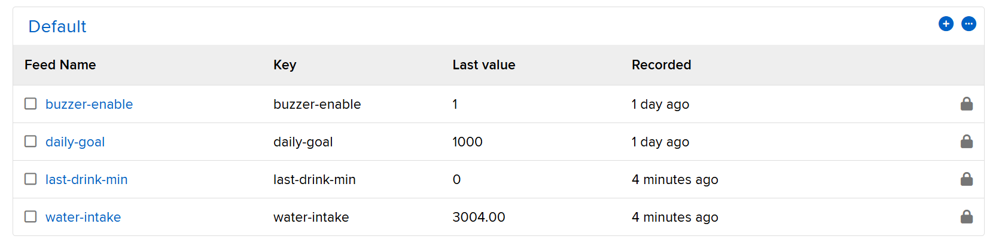
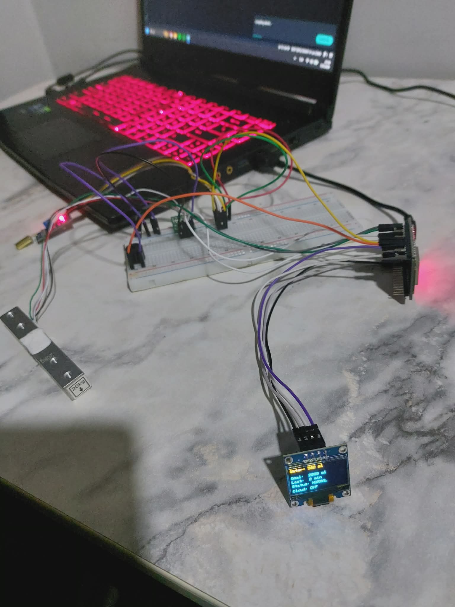

# 💧 Smart Bottle Usage and Water Intake Tracking System

An IoT-based smart bottle system built with **ESP32** that tracks daily water consumption, reminds users to drink water, and syncs data to the cloud using **Adafruit IO**.

> **Akdeniz University – CSE 328 Internet of Things Term Project**  
> **Student:** Ozan Ergüleç – 20210808069

---

## 📌 Project Summary

This project aims to promote healthy hydration habits by monitoring a user's daily water intake using an IoT-based system. The system uses a **tilt sensor** to detect when the bottle is lifted for drinking and a **load cell sensor** to measure the amount of water consumed. By combining these two sensors, the system can accurately identify real drinking events and avoid false detections.

The collected data is sent to a cloud platform where users can monitor their total water intake, drinking frequency, and hydration patterns. The system also reminds users to drink water if no activity is detected for a certain period. An **OLED display** provides real-time feedback, such as current water intake and system status. Additionally, users can control reminder settings and daily intake goals through the cloud dashboard.

---

## ⚙️ Features

- 💧 Real-time water intake tracking (ml)
- 📊 Cloud integration with **Adafruit IO** (MQTT over SSL)
- ⏱️ Tracks last drinking time
- 🔔 Smart reminder system (buzzer alert when inactive for too long)
- 🎯 Adjustable daily water goal (via cloud dashboard)
- 📺 OLED display for live status information
- 🌐 Remote control (enable/disable reminders from dashboard)
- 🧠 Smart detection using combined tilt + weight analysis (avoids false triggers)

---

## 🔧 Hardware Components

| Component | Model / Type | Task |
|---|---|---|
| Microcontroller | **ESP32** | Main controller, Wi-Fi connectivity |
| Sensor 1 | **Tilt Sensor (SW-520D)** | Detects bottle movement and drinking action |
| Sensor 2 | **Load Cell + HX711 Amplifier** | Measures weight of the bottle to calculate water consumption |
| Display | **SSD1306 OLED (128×64, I2C)** | Shows real-time water intake, goal, status |
| Actuator | **Buzzer** | Alerts the user when it is time to drink water |
| Cloud Platform | **Adafruit IO** | Dashboard, data storage, remote control |

---

## 🏗️ System Architecture

```
┌──────────────┐       ┌──────────────────┐       ┌──────────────┐
│  Tilt Sensor │──────▶│                  │──────▶│ OLED Display │
│  (SW-520D)   │       │                  │       │ (SSD1306)    │
└──────────────┘       │     ESP32        │       └──────────────┘
                       │                  │
┌──────────────┐       │   (Main MCU)     │       ┌──────────────┐
│  Load Cell   │──────▶│                  │──────▶│   Buzzer     │
│  + HX711     │       │                  │       └──────────────┘
└──────────────┘       └────────┬─────────┘
                                │
                          ┌─────▼─────┐
                          │   Wi-Fi   │
                          └─────┬─────┘
                                │
                       ┌────────▼────────┐
                       │ Adafruit IO     │
                       │ Cloud Dashboard │
                       └─────────────────┘
```

The **ESP32** acts as the main controller of the system. It continuously reads data from the tilt sensor and the load cell sensor. When the tilt sensor detects that the bottle is lifted and the load cell measures a decrease in weight, the system identifies a valid drinking event. The calculated water intake is then sent to the cloud platform via Wi-Fi. The OLED display shows real-time information such as total water intake, system status, and last drinking time. If no drinking activity is detected for a predefined period, the ESP32 activates the buzzer to remind the user. Users can monitor hydration data and control reminder settings through the cloud dashboard.

---

## 🧠 How It Works

1. The system continuously reads:
   - **Tilt sensor** → bottle position (upright or tilted)
   - **Load cell** → current weight of the bottle

2. A **drinking event is detected** when:
   - The bottle is tilted (lifted for drinking)
   - It remains tilted for at least **800 ms** (to filter accidental bumps)
   - Then returned upright
   - And weight decreases by at least **10 ml**

3. The consumed water amount is calculated:

```cpp
consumed = previous_weight - current_weight;
total_intake += consumed;
```

4. Data is sent to **Adafruit IO** via MQTT over SSL:
   - `water-intake` → total consumed water (ml)
   - `last-drink-min` → minutes since last drink

5. The system listens for cloud commands:
   - `daily-goal` → update daily water goal (ml)
   - `buzzer-enable` → enable/disable reminder buzzer (`ON`/`OFF`)

---

## 📺 OLED Display Content

The OLED screen shows 5 lines of real-time information:

```
┌────────────────────────┐    ┌────────────────────────┐
│ Water: 850 ml          │    │ Water: 900 ml          │
│ Goal:  2000 ml         │    │ Goal:  2000 ml         │
│ Last:  15 min          │    │ Last:  60 min          │
│ Status: NORMAL         │    │ Status: DRINK NOW!     │
│ Cloud: ON              │    │ Cloud: ON              │
└────────────────────────┘    └────────────────────────┘
       Normal State                Reminder State
```

**Status values:**
| Status | Condition |
|---|---|
| `NORMAL` | Everything is fine, user is drinking regularly |
| `DRINK NOW!` | No drinking activity detected for ≥ 60 minutes |
| `GOAL DONE!` | Daily water goal has been reached 🎉 |

---

## 🔌 Pin Configuration

| Pin | Component | Description |
|-----|-----------|-------------|
| GPIO 4 | HX711 DOUT | Load cell data output |
| GPIO 5 | HX711 SCK | Load cell clock |
| GPIO 18 | Tilt Sensor | Bottle tilt detection |
| GPIO 19 | Buzzer | Reminder alert output |
| GPIO 21 | SDA | I2C data (OLED) |
| GPIO 22 | SCL | I2C clock (OLED) |

---

## 🔊 Buzzer Sound Patterns

| Sound | Pattern | When |
|-------|---------|------|
| ✅ Confirmation | Short ascending beep | A valid drinking event is detected |
| ⏰ Reminder | Two medium beeps | No drinking activity for the reminder interval |
| 🎉 Goal Reached | Three-note melody (C-E-G) | Daily water goal has been reached |

---

## ☁️ Cloud Dashboard (Adafruit IO)

The system uses **Adafruit IO** as the cloud platform with the following feeds:

### Published Feeds (ESP32 → Cloud)
| Feed | Data | Update Frequency |
|------|------|-----------------|
| `water-intake` | Total water consumed (ml) | On each drinking event |
| `last-drink-min` | Minutes since last drink | Every 30 seconds |

### Subscribed Feeds (Cloud → ESP32)
| Feed | Data | Effect |
|------|------|--------|
| `daily-goal` | Target water intake (ml) | Updates the daily goal |
| `buzzer-enable` | `ON` / `OFF` / `1` / `true` | Enables or disables buzzer reminders |

---

## 📁 Project Structure

```
esp32-water-tracker/
├── IOT-PROJE/
│   └── IOT-PROJE.ino      # Main Arduino sketch (ESP32 firmware)
└── README.md               # Project documentation
```

---

## 🚀 Getting Started

### Prerequisites

- **Arduino IDE** (2.x recommended)
- **ESP32 Board Package** installed in Arduino IDE
- An **Adafruit IO** account ([io.adafruit.com](https://io.adafruit.com))

### Required Libraries

Install the following libraries via Arduino Library Manager:

| Library | Purpose |
|---------|---------|
| `Adafruit SSD1306` | OLED display driver |
| `Adafruit GFX Library` | Graphics primitives for OLED |
| `HX711_ADC` | Load cell amplifier interface |
| `Adafruit MQTT Library` | MQTT client for Adafruit IO |
| `WiFiClientSecure` | SSL/TLS for secure MQTT connection |

### Setup Steps

1. **Clone the repository:**
   ```bash
   git clone https://github.com/ozanergulec/esp32-water-tracker.git
   ```

2. **Open the project** in Arduino IDE:
   - Open `IOT-PROJE/IOT-PROJE.ino`

3. **Configure your credentials** in the code:
   ```cpp
   #define WIFI_SSID       "your-wifi-name"
   #define WIFI_PASSWORD   "your-wifi-password"
   #define AIO_USERNAME    "your-adafruit-username"
   #define AIO_KEY         "your-adafruit-io-key"
   ```

4. **Create Adafruit IO feeds:**
   - `water-intake`
   - `last-drink-min`
   - `daily-goal`
   - `buzzer-enable`

5. **Select ESP32 board** and upload the sketch.

6. **Wire the components** according to the [Pin Configuration](#-pin-configuration) table.

7. **Calibrate the load cell** by adjusting the `KALIBRASYON_FAKTORU` value for your specific setup.

---

## 📊 Dashboard Data Processing

The cloud dashboard provides the following capabilities:

- **Real-time monitoring** of both sensors (tilt + weight)
- **Alerts and thresholds** for hydration reminders
- **Data visualization** including:
  - Total daily water intake
  - Drinking frequency and patterns
  - Min/Max/Average consumption statistics
- **Remote actuator control** (buzzer enable/disable)
- **Adjustable daily goal** setting

---

## 🛠️ Calibration

The load cell needs to be calibrated for accurate weight measurements:

1. Place the empty bottle on the load cell
2. Note the raw reading
3. Place a known weight (e.g., 500 ml of water = ~500 g)
4. Calculate the calibration factor:
   ```
   KALIBRASYON_FAKTORU = raw_reading / known_weight
   ```
5. Update the value in the code and re-upload

---

## 📄 License

This project was developed as a term project for **CSE 328 – Internet of Things** at **Akdeniz University**.

---

## 👤 Author

**Ozan Ergüleç**  
Student No: 20210808069  
Akdeniz University – Computer Science Engineering

---

## 📊 Dashboard





---

## 📸 Evidence

